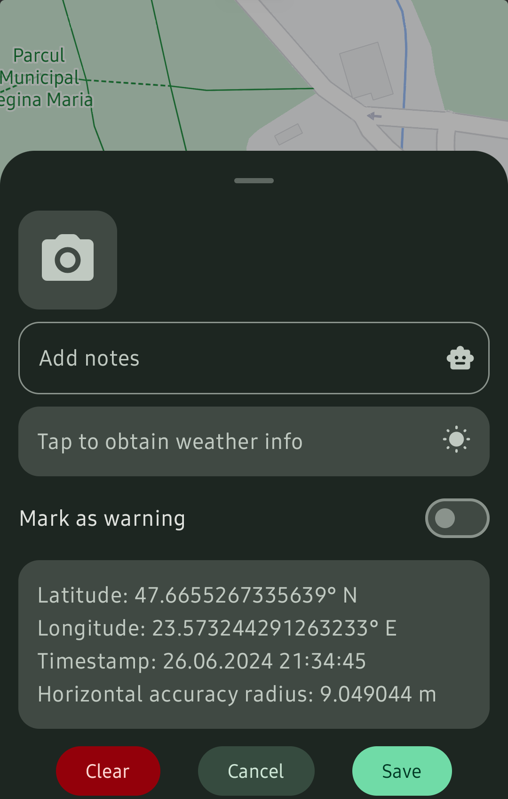
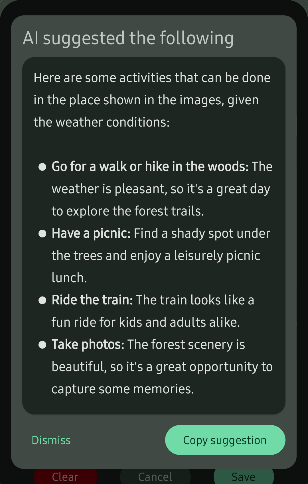

# 🗺️ AI assisted mobile app for creating and sharing tourist trails 

An Android app that allows the creation of personalized tourist trails with assistance from artificial intelligence, as well as the sharing and discovery of these routes. The trails are created by recording user coordinates, with the option to add relevant information for each waypoint, such as photos, notes, weather conditions, hazard warnings, and so on. The photos are analyzed by a classification model based on convolutional neural networks that can determine their location type in order to obtain suggestions for outdoor activities. These suggestions are generated based on the provided information at the respective waypoint. The discovery of public trails is done by searching for them in the system or by displaying the routes in the user's vicinity. This app was developed as part of my master's thesis project.

| | | |
| - | - | - |
|  |  |  |

## ✨ Features

- Authentication system
- Permissions and location availability handling
- Trail creation that records the user's coordinates and displays the taken route on a map
- Modal to add or modify information for each point of the trail, such as:
  - photos that can be taken using the built-in camera
  - user notes
  - weather conditions that can be fetched and refreshed by calling an API
  - hazard warnings
- Location type recognition of the taken photos using a classification model based on convolutional neural networks
- Generation of activity suggestions based on the information added at respective waypoints with possible configuration
- Interactive map markers that illustrate added information
- Trail saving and online publishing
- User profile that contains their own trails
- Trail preview screen that contains related info, metrics, weather conditions by days and hours, and a timeline of documented waypoints
- Launch of a selected trail and display it on the map with navigation buttons
- Path display of every nearby trail within a 10 km radius on the map with info display on click
- Discover screen that contains nearby and random trails with searching capabilities
- Light and Dark mode
- Other nice things 

## 🔮 Technologies

- **Kotlin** for the app development
- **Python** for the location classification model development
- **Jetpack Compose** for the app UI
- **Navigation Compose** for navigation across the app
- **Kotlin Coroutines** to write non-blocking code that can be suspended and resumed
- **Kotlin Flows** to handle streams of data asynchronously
- **Kotlin Parcelize** to make classes parcelable by generating the required methods automatically
- **Kotlin Serialization** to convert objects to and from various serialization formats, such as JSON
- **Koin** for dependency injection  
- **TensorFlow** as a development environment for AI models 
- **Keras** to build the location classification model
- **Gemini Flash** to generate activity suggestions based on provided data
- **Firebase** for authentication, database and cloud storage
- **Google Maps SDK** to show the map, routes, markers, and other related elements
- **Accompanist Permissions** to request runtime permissions like location and camera in Jetpack Compose
- **Fused Location Provider** to obtain the current location of the device
- **CameraX** to take photos using the device camera
- **Retrofit** for type-safe HTTP requests
- **Coil** for asynchronous image loading
- Other nice things 

## 🏗️ Architecture

The app is built on top of the **Model-View-Intent** (MVI) architecture and follows the principles of **Clean Architecture** for maintainability and scalability.

## 👀 Preview

| Login | Register | Password reset |
| - | - | - |
|  |  |  |

| Location permission request | User location on map | No location warning |
| - | - | - |
|  |  |  |

| Travelled route | Waypoint info modal (empty) | Camera permission request |
| - | - | - |
|  |  |  |

| Taking photos | Waypoint info modal (populated) | Taken photo preview with location detection |
| - | - | - |
|  |  |  

Other detections

|

| Suggestion dialog configuration | Generated activity suggestions | Trail info markers on map |
| - | - | - |
|  |  |  |

| Trail saving | User profile | Trail info |
| - | - | - |
|  |  |  |

| Trail info edit | Launched trail | Launched trail info |
| - | - | - |
|  |  |  |

| Trails discovery | Nearby trails on map |
| - | - |
|  |  |